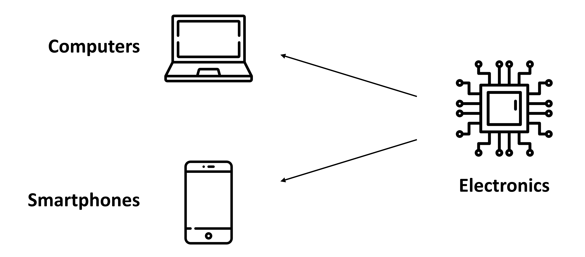

## Inheritance

see code file in this [folder](./01-inheritance)

In our everyday life, we **tend to divide things into groups**, based on their shared characteristics. Here are some groups that you have probably used yourself: electronics, tools, vehicles, or plants.

**Sometimes these groups have hierarchies**. For example, computers and smartphones are both types of electronics, but computers and smartphones are also groups in and of themselves. You can imagine a tree with "electronics" at the top, and "computers" and "smartphones" each as children of the "electronics" node.



Object-oriented programming uses the same principles! For instance, imagine a `Vehicle` class:

```cpp
class Vehicle {
public:
  int wheels = 0;
  string color = "blue";

  void Print() const
  {
    std::cout << "This " << color << " vehicle has " << wheels << " wheels!\n";
  }
};
```

We can derive other classes from `Vehicle`, such as `Car` or `Bicycle`. **One advantage is that this saves us from having to re-define all of the common member variables** - in this case, `wheels` and `color` - in each derived class.

**Another benefit is that derived classes**, for example `Car` and `Bicycle`, can **have distinct member variables**, such as `sunroof` or `kickstand`. Different derived classes will have different member variables:

```cpp
class Car : public Vehicle {
public:
  bool sunroof = false;
};

class Bicycle : public Vehicle {
public:
  bool kickstand = true;
};
```


### Example: Inheritance

1. Add a new member variable to `class Vehicle`.
2. Output that new member in `main()`.
3. Derive a new class from `Vehicle`, alongside `Car` and `Bicycle`.
4. Instantiate an object of that new class.
5. Print the object.


### Inherited Access Specifiers

Just as access specifiers (i.e. `public`, `protected`, and `private`) define which class members *users* can access, the same access modifiers also define which class members *users of a derived classes* can access.

> [Public inheritance:](https://en.cppreference.com/w/cpp/language/derived_class#Public_inheritance) the public and protected members of the **base class** listed after the specifier keep their member access in the **derived class**
>
> [Protected inheritance:](https://en.cppreference.com/w/cpp/language/derived_class#Protected_inheritance) the public and protected members of the **base class** listed after the specifier are protected members of the **derived class**
>
> [Private inheritance:](https://en.cppreference.com/w/cpp/language/derived_class#Private_inheritance) the public and protected members of the base class listed after the specifier are **private members of the derived class**
>
> Source: [C++ reference](https://en.cppreference.com/w/cpp/language/access)


### Example: Inherited Access Specifiers

**Instructions**

1. Update the derived classes so that one has `protected` inheritance and one has `private` inheritance.
2. Try to access a `protected` member from `main()`. Is it possible?
3. Try to access a `private` member from `main()`. Is it possible?
4. Try to access a member of the base class from within the derived class that has `protected` inheritance. Is it possible?
5. Try to access a member of the base class from within the derived class that has `private` inheritance. Is it possible?


### Example: Animal Class

**Instructions**

1. Define a class `Animal`.
2. Define 3 member variables: `color`, `name`, `age`.
3. Define a derived class `Snake` that inherits from the base class `Animal`.
4. Create a member variable `length` for the `Snake` class.
5. Create a derived class `Cat` that inherits from the base class `Animal`.
6. Create a member variable `height` for the `Cat` class.
7. Create `MakeSound()` member functions for each of the derived classes.
8. In the `main()` function instantiate `Snake` and `Cat` objects. Initialize both their unique and derived attributes. Program them to make a sound.


### Composition


[Composition](https://en.wikipedia.org/wiki/Composition_over_inheritance) is a **closely related alternative to inheritance**. Composition involves **constructing ("composing") classes from other classes**, **instead of inheriting** traits from a parent class.

A common way to distinguish "composition" from "inheritance" is to think about what an object can do, rather than what it is. This is often expressed as [**"has a"**](https://en.wikipedia.org/wiki/Has-a) versus [**"is a"**](https://en.wikipedia.org/wiki/Is-a).

From the standpoint of composition, a cat **"has a"** head and "has a" set of paws and "has a" tail.

From the standpoint of inheritance, a cat **"is a"** mammal.

There is [no hard and fast rule](https://www.google.com/search?q=when+to+use+composition+and+when+to+use+inheritance&oq=when+to+use+composition+and+when+to+use+inheritance) about when to prefer composition over inheritance. In general, **if a class needs only extend a small amount of functionality** beyond what is already offered by another class, it makes sense to **inherit** from that other class. However, **if a class needs to contain functionality from a variety of otherwise unrelated classes**, it makes sense to **compose** the class from those other classes.

In this example, you'll practice working with composition in C++.

### Example: composition

**Instructions**

In this exercise, you will start with a `LineSegment` struct and create a `Circle` class.

Note that you will compose `Circle` from `LineSegment`, instead of inheriting `Circle` from `LineSegment`. Specifically, the `length` attribute from `LineSegment` will become the circle's radius.

1. Create a struct `LineSegment`.
2. Declare an attribute `length` in struct `LineSegment`.
3. Define pi (3.14159) with a macro.
4. Create a class `Circle`, composed of a `LineSegment` that represents the circle's radius. Use this radius to calculate the area of the circle (area of a circle = πr^2).
5. Verify the behavior of `Circle` in `main()`.


### Multi-level inheritance

Multi-level inheritance is term used for chained classes in an inheritance tree.

```cpp
#include <cassert>

// TODO: Declare Vehicle as the base class
class Vehicle {};

// TODO: Derive Car from Vehicle
class Car : public Vehicle {
	public:
		int wheels{4};
};

// TODO: Derive Sedan from Car
class Sedan : public Car {
	public:
		bool trunk{true};
		int seats{4};
};

// TODO: Update main to pass the tests
int main() {
	Sedan sedan;
  assert(sedan.trunk == true);
  assert(sedan.seats == 4);
  assert(sedan.wheels == 4);
}
```


### Friends

In C++, `friend` classes provide an **alternative inheritance mechanism** to derived classes. The main difference between classical inheritance and friend inheritance is that a `friend` class can **access private members of the base class**, which isn't the case for classical inheritance. In **classical inheritance,** a derived class **can only access public and protected members** of the base class.


### Example: Friends

In this exercise, you will experiment with friend classes. In the notebook below, implement the following steps:

1. Declare a class `Rectangle`.
2. Define a class `Square` as friend of `Rectangle`
   - Add a public constructor to `Square` class, initialize side.
   - Add friend class `Rectangle`.
   - Add private attribute side to `Square`.
3. Define class `Rectangle`
   - Add public declarations of the class constructor and *Area()* method.
   - Add private attributes *width* and *height*.
4. Outside class `Rectangle`, and using class scope of resolution (::).
   - Define a `Rectangle` constructor that takes a `Square`.
   - Define *Area()* to compute the area of `Rectangle`.


## Polymorphism

see code file in this [folder](./02-polymorphism)

[Polymorphism](https://www.merriam-webster.com/dictionary/polymorphism) is means "assuming many forms".

In the context of object-oriented programming, [polymorphism](https://en.wikipedia.org/wiki/Polymorphism_(computer_science)) describes a paradigm in which a function may behave differently depending on how it is called. In particular, the function will perform differently based on its inputs.

Polymorphism can be achieved in two ways in C++: overloading and overriding. In this exercise we will focus on overloading.

### Overloading

In C++, you can write two (or more) versions of a function with the same name. This is called ["overloading"](https://en.wikipedia.org/wiki/Function_overloading). Overloading requires that we leave the function name the same, but we modify the function signature. For example, we might define the same function name with multiple different configurations of input arguments.

This example of `class Date` overloads:

```cpp
#include <ctime>

class Date {
public:
    Date(int day, int month, int year) : day_(day), month_(month), year_(year) {}
    Date(int day, int month) : day_(day), month_(month)  // automatically sets the Date to the current year
    {
        time_t t = time(NULL);
	    tm* timePtr = localtime(&t);
        year_ = timePtr->tm_year;
    }

private:
    int day_;
    int month_;
    int year_;
};
```


### Example: Overloading

**Instructions**

Overloading can happen outside of an object-oriented context, too. In this exercise, you will practice overloading a normal function that is not a class member.

1. Create a function `hello()` that outputs, "Hello, World!"
2. Create a `class Human`.
3. Overload `hello()` by creating a function `hello(Human human)`. This function should output, "Hello, Human!"
4. Create 2 more classes and use those classes to further overload the `hello()` function.


### Operator Overloading

. In this exercise you'll see how to achieve polymorphism with [operator overloading](https://en.cppreference.com/w/cpp/language/operators). You can choose any operator from the ASCII table and give it your own set of rules!

Operator overloading can be useful for many things. Consider the `+` operator. We can use it to add `int`s, `double`s, `float`s, or even `std::string`s.

In order to overload an operator, use the `operator` keyword in the function signature:

```cpp
Complex operator+(const Complex& addend) {
  //...logic to add complex numbers
}
```

Imagine vector addition. You might want to perform vector addition on a pair of points to add their x and y components. The compiler won't recognize this type of operation on its own, because this data is user defined. However, you can overload the `+` operator so it performs the action that you want to implement.


### Example: Operator Overloading

**Instructions**

1. Define class `Point`.
2. Declare a prototype of overload method for `+` operator.
3. Confirm the tests pass.


### Virtual Functions

Virtual functions are a polymorphic feature. These functions are declared (and possibly defined) in a base class, and can be overridden by derived classes.

This approach declares an [interface](http://isocpp.github.io/CppCoreGuidelines/CppCoreGuidelines#S-glossary) at the base level, but delegates the implementation of the interface to the derived classes.

In this exercise, `class Shape` is the base class. Geometrical shapes possess both an area and a perimeter. `Area()` and `Perimeter()` should be virtual functions of the base class interface. Append `= 0` to each of these functions in order to declare them to be "pure" virtual functions.

A [pure virtual function](http://isocpp.github.io/CppCoreGuidelines/CppCoreGuidelines#S-glossary) is a [virtual function](http://isocpp.github.io/CppCoreGuidelines/CppCoreGuidelines#S-glossary) that the base class [declares](http://isocpp.github.io/CppCoreGuidelines/CppCoreGuidelines#S-glossary) but does not [define](http://isocpp.github.io/CppCoreGuidelines/CppCoreGuidelines#S-glossary).

A pure virtual function has the side effect of making its class [abstract](http://isocpp.github.io/CppCoreGuidelines/CppCoreGuidelines#S-glossary). This means that the class cannot be instantiated. Instead, only classes that derive from the abstract class and override the pure virtual function can be instantiated.

```cpp
class Shape {
    public:
        Shape() {}
        virtual double Area() const = 0;
        virtual double Perimeter() const = 0;
};
```

Virtual functions can be defined by derived classes, but this is not required. However, if we mark the virtual function with `= 0` in the base class, then we are declaring the function to be a pure virtual function. This means that the base class does not define this function. A derived class must define this function, or else the derived class will be abstract.


### Example: Virtual functions

**Instructions**

1. Create base class called `Shape`.
2. Define pure virtual functions (`= 0`) for the base class.
3. Write the derived classes.
   - Inherit from `class Shape`.
   - Override the pure virtual functions from the base class.
4. Test in `main()`


### Overriding

["Overriding"](http://isocpp.github.io/CppCoreGuidelines/CppCoreGuidelines#glossary) a function occurs when:

1. A base class declares a [`virtual` function](http://isocpp.github.io/CppCoreGuidelines/CppCoreGuidelines#glossary function).
2. A derived class *overrides* that virtual function by defining its own implementation with an identical function signature (i.e. the same function name and argument types).

```cpp
class Animal {
public:
  virtual std::string Talk() const = 0;
};

class Cat : public Animal {
public:
  std::string Talk() const { return std::string("Meow"); }
};
```

In this example, `Animal` exposes a `virtual` function: `Talk()`, but does not define it. Because `Animal::Talk()` is undefined, it is called a [*pure virtual function*](http://isocpp.github.io/CppCoreGuidelines/CppCoreGuidelines#glossary), as opposed to an ordinary (impure? 😉) [*virtual function*](http://isocpp.github.io/CppCoreGuidelines/CppCoreGuidelines#glossary).

Furthermore, because `Animal` contains a pure virtual function, the user cannot instantiate an object of type `Animal`. This makes `Animal` an [*abstract class*](http://isocpp.github.io/CppCoreGuidelines/CppCoreGuidelines#glossary).

`Cat`, however, inherits from `Animal` and overrides `Animal::Talk()` with `Cat::Talk()`, which is defined. Therefore, it is possible to instantiate an object of type `Cat`.


### Example: Overriding

**Instructions**

1. Create a class `Dog` to inherit from `Animal`.
2. Define `Dog::Talk()` to override the virtual function `Animal::Talk()`.
3. Confirm that the tests pass.


### Override

"Overriding" a function occurs when a derived class defines the implementation of a `virtual` function that it inherits from a base class.

It is possible, but not required, to specify a function declaration as `override`.

```cpp
class Shape {
public:
  virtual double Area() const = 0;
  virtual double Perimeter() const = 0;
};

class Circle : public Shape {
public:
  Circle(double radius) : radius_(radius) {}
  double Area() const override { return pow(radius_, 2) * PI; } // specified as an override function
  double Perimeter() const override { return 2  *radius_*  PI; } // specified as an override function

private:
  double radius_;
};
```

This specification tells both the compiler and the human programmer that the purpose of this function is to override a virtual function. The compiler will verify that a function specified as `override` does indeed override some other virtual function, or otherwise the compiler will generate an error.

Specifying a function as `override` is [good practice](http://isocpp.github.io/CppCoreGuidelines/CppCoreGuidelines#Rh-override), as it empowers the compiler to verify the code, and communicates the intention of the code to future users.


### Example: Override

In this exercise, you will build two [vehicle motion models](http://www.cs.cmu.edu/~motionplanning/reading/PlanningforDynamicVeh-1.pdf), and override the `Move()` member function.

The first motion model will be `class ParticleModel`. In this model, the state is `x`, `y`, and `theta` (heading). The `void Move(double v, double phi)` function for this model includes instantaneous steering:

```cpp
theta += phi
x += v * cos(theta)
y += v * cos(theta)
```

The second motion model will be `class BicycleModel`. In this model, the state is `x`, `y`, `theta` (heading), and `L` (the length of the vehicle). The `void Move(double v, double phi)` function for this model is affected by the length of the vehicle:

```cpp
theta += v / L * tan(phi)
x += v * cos(theta)
y += v * cos(theta)
```

You are encouraged to [read more](http://www.cs.cmu.edu/~motionplanning/reading/PlanningforDynamicVeh-1.pdf) about vehicle motion, but for the purposes of practicing function overriding, the precise motion models are not so important. What is important is that the two models, and thus to the two `Move()` functions, are *different*.

**Instructions**

1. Define `class ParticleModel`, including its state and `Move()` function.
2. Extend `class BicycleModel` from `class ParticleModel`.
3. Override the `Move()` function within `class BicycleModel`.
4. Specify `BicycleModel::Move()` as [`override`](http://isocpp.github.io/CppCoreGuidelines/CppCoreGuidelines#c128-virtual-functions-should-specify-exactly-one-of-virtual-override-or-final).
5. Pass the tests in `main()` by verifying that the two `Move()` functions override each other in different scenarios.


## Multiple Inheritance

see code file in this [folder](./03-multiple-inheritance)

In this exercise, you'll get some practical experience with multiple inheritance. If you have class `Animal` and another class `Pet`, then you can construct a class `Dog`, which inherits from both of these base classes. In doing this, you are able to incorporate attributes of multiple base classes.

The Core Guidelines have some worthwhile recommendations about how and when to use multiple inheritance:

- ["Use multiple inheritance to represent multiple distinct interfaces"](http://isocpp.github.io/CppCoreGuidelines/CppCoreGuidelines#c135-use-multiple-inheritance-to-represent-multiple-distinct-interfaces)
- ["Use multiple inheritance to represent the union of implementation attributes"](http://isocpp.github.io/CppCoreGuidelines/CppCoreGuidelines#c136-use-multiple-inheritance-to-represent-the-union-of-implementation-attributes)


### Example: Multiple Inheritance

**Instructions**

1. Review `class Dog`, which inherits from both `Animal` and `Pet`.
2. Declare a `class Cat`, with a member attribute `color`, that also inherits from both `Animal` and `Pet`.
3. Instantiate an object of `class Cat`.
4. Configure that object to pass the tests in `main()`.


## Generic Programming

see code file in this [folder](./04-templates)

### Templates

Templates enable generic programming by generalizing a function to apply to any class. Specifically, templates use *types* as parameters so that the same implementation can operate on different data types.

For example, you might need a function to accept many different data types. The function acts on those arguments, perhaps dividing them or sorting them or something else. Rather than writing and maintaining the multiple function declarations, each accepting slightly different arguments, you can write one function and pass the argument types as parameters. At compile time, the compiler then expands the code using the types that are passed as parameters.

```cpp
template <typename Type> Type Sum(Type a, Type b) { return a + b; }

int main() { std::cout << Sum<double>(20.0, 13.7) << "\n"; }
```

Because `Sum()` is defined with a template, when the program calls `Sum()` with `double`s as parameters, the function expands to become:

```cpp
double Sum(double a, double b) {
    return a+b;
}
```

Or in this case:

```cpp
std::cout << Sum<char>(‘Z’, ’j’) << "\n";
```

The program expands to become:

```cpp
char Sum(char a, char b) {
    return a+b;
}
```

We use the keyword `template` to specify which function is generic. Generic code is the term for code that is independent of types. It is mandatory to put the `template<>` tag before the function signature, to specify and mark that the declaration is generic.

Besides `template`, the keyword `typename` (or, alternatively, `class`) specifies the generic type in the function prototype. The parameters that follow `typename` (or `class`) represent generic types in the function declaration.

In order to instantiate a templatized class, use a templatized constructor, for example: `Sum<double>(20.0, 13.7)`. You might recognize this form as the same form used to construct a `vector`. That's because `vector`s are indeed a generic class!


### Example: Comparison Operator using Template

This exercise demonstrates how a simple comparison between two variables of unknown type can work using templates. In this case, by defining a generic function using a template that performs a comparison using the `>` operator, you can compare two variables of any type (both variables must be of the same type, though) as long as the operator `>` is defined for that type.

Check out the notebook below to see how that works.


### Example: Deduction

In this example, you will see the difference between total and partial [deduction](https://isocpp.github.io/CppCoreGuidelines/CppCoreGuidelines#Rt-deduce).

Deduction occurs when you instantiate an object without explicitly identifying the types. Instead, the compiler "deduces" the types. This can be helpful for writing code that is generic and can handle a variety of inputs.

In this exercise, we will use templates to overload the '#' operator to average two numbers.

**Instructions**

1. Use a template to overload the # operator.
2. Confirm that the tests pass.


### Example: Class Template

Classes are the building blocks of object oriented programming in C++. Templates support the creation of generic classes!

Class templates can declare and implement generic attributes for use by generic methods. These templates can be very useful when building classes that will serve multiple purposes.

In this exercise you will create a `class Mapping` that maps a generic key to a generic value.

All of the code has been written for you, except the initial template specification.

In order for this template specification to work, you will need to include two generic types: `KeyType` and `ValueType`. Can you imagine how to do that?

**Instructions**

1. Write the template specification.
2. Verify that the test passes.

