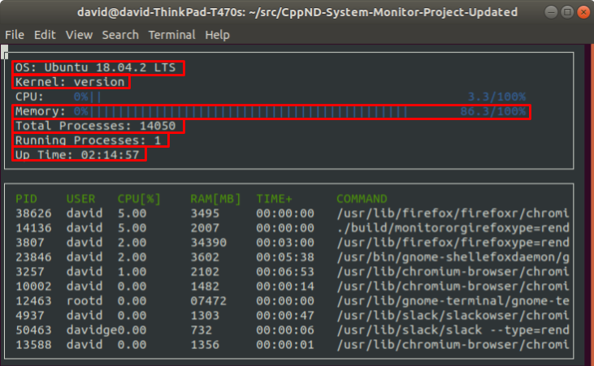

# Project Structure


1. **Project Organization**: The project is organized into several key directories, including `Include` and `Source`, which are common in C++ projects. The `Include` directory contains header files (`.h`) that declare interfaces, while the `Source` directory contains implementation files (`.cpp`).

2. **Namespace Structure**: The Linux parser is defined as a namespace rather than a class, which allows for a cleaner organization of functions related to parsing system data.

3. **File Paths**: It includes constant strings that define paths to various files in the `/proc` directory, which is where Linux stores system information.

4. **Functions**: several key functions within the Linux parser namespace, such as:

   - Functions to retrieve system uptime, memory utilization, and process information.

   - Each function reads data from the appropriate files in the `/proc` directory and returns relevant information.

5. **Data Retrieval**: The parser functions are designed to read and parse data directly from the file system, ensuring that the information is up-to-date and accurate.


```
📦 project-root
 ┣ 📂 build                # Build output directory for compiled files
 ┣ 📂 dev                  # Development-related files and configurations
 ┣ 📂 images               # Resource directory for project images/assets
 ┣ 📂 include              # Header files directory containing interface declarations
 ┃ ┣ 📜 format.h             # Utility functions for formatting system data (time, memory)
 ┃ ┣ 📜 linux_parser.h       # Namespace for parsing Linux system information from /proc
 ┃ ┣ 📜 ncurses_display.h    # Interface for ncurses-based system monitor display
 ┃ ┣ 📜 process.h            # Class definition for individual process management
 ┃ ┣ 📜 processor.h          # CPU utilization tracking and calculations
 ┃ ┗ 📜 system.h             # Main system class managing overall system metrics
 ┣ 📂 src                  # Source files directory containing implementations
 ┃ ┣ 📜 format.cpp           # Implementation of data formatting utilities
 ┃ ┣ 📜 linux_parser.cpp     # Implementation of Linux system data parsing
 ┃ ┣ 📜 main.cpp             # Program entry point and initialization
 ┃ ┣ 📜 ncurses_display.cpp  # Implementation of UI display logic
 ┃ ┣ 📜 process.cpp          # Process class implementation for system processes
 ┃ ┣ 📜 processor.cpp        # CPU metrics calculation implementation
 ┃ ┗ 📜 system.cpp           # System class implementation for overall monitoring
 ┣ 📜 .clang-format        # Clang formatter configuration for code style
 ┣ 📜 .gitignore           # Git configuration for ignored files/directories
 ┣ 📜 CMakeLists.txt       # CMake build system configuration
 ┣ 📜 Makefile             # Make build automation with targets (build, format, clean)
 ┗ 📜 README.md            # Project documentation and setup instructions

```


# Build Tools

1. **Makefile Structure**: The Makefile is introduced as a tool to automate the build process. It contains various targets that define different actions, such as building the project, formatting code, and cleaning up build artifacts.
2. **Key Targets**:
   - **`all`**: This target runs both the **format and build** targets.
   - **`clean`**: This target **removes the build directory** and all build artifacts, effectively cleaning the project.
   - **`build`**: This target compiles the project, utilizing CMake to **generate the necessary build files**.
   - **`format`**: This target runs a **code formatter** to ensure that the code adheres to stylistic guidelines.
   - **`debug`**: This target compiles the code with debug symbols, allowing for easier **debugging**.


# System Data



Linux stores a lot of system data in files within the `/proc` directory. Most of the data that this project requires exists in those files.

## Operating System

Information about the operating system exists outside of the `/proc` directory, in the `/etc/os-release` file.


There are several strings from which to choose here, but the most obvious is the value specified by "PRETTY_NAME".

## Kernel

Information about the kernel exists `/proc/version` file.


## Memory Utilization

Information about memory utilization exists in the `/proc/meminfo` file.


There are a [variety](https://www.thegeekdiary.com/understanding-proc-meminfo-file-analyzing-memory-utilization-in-linux/) of [ways](https://access.redhat.com/solutions/406773) to use this data to calculate memory utilization.

[Hisham H. Muhammad](http://hisham.hm/about), the author of [htop](http://hisham.hm/htop/index.php), wrote a [Stack Overflow answer](https://stackoverflow.com/a/41251290) about how htop calculates memory utilization from the data in `/proc/meminfo`.

> - Total used memory = `MemTotal` - `MemFree`
> - Non cache/buffer memory (green) = Total used memory - (Buffers + Cached memory)
> - Buffers (blue) = `Buffers`
> - Cached memory (yellow) = `Cached` + `SReclaimable` - `Shmem`
> - Swap = `SwapTotal` - `SwapFree`
>
> In the htop source code: [linux/LinuxProcessList.c](https://github.com/hishamhm/htop/blob/8af4d9f453ffa2209e486418811f7652822951c6/linux/LinuxProcessList.c#L802-L833) and [linux/Platform.c](https://github.com/hishamhm/htop/blob/1f3d85b6174f690a7e354bbadac19404d5e75e78/linux/Platform.c#L198-L208).

Use the formula that makes the most sense to you!

## Total Processes

Information about the total number of processes on the system exists in the `/proc/stat` file.


## Running Processes

Information about the number of processes on the system that are currently running exists in the `/proc/stat` file. 


## Up Time

Information about system up time exists in the `/proc/uptime` file.


> This file contains two numbers (values in seconds): the uptime of the system (including time spent in suspend) and the amount of time spent in the idle process.

From the [*man* page for `proc`](http://man7.org/linux/man-pages/man5/proc.5.html)


# System Class

1. **Overview of the System Class**: The system class is designed to manage system-related information, including the CPU and a collection of processes.

2. **Member Variables**: It contains private member variables for the CPU and processes, along with public accessor functions that provide access to these variables.

3. **Functionality**: The class includes functions to return various system metrics, such as memory utilization, uptime, total number of processes, and the number of running processes.

4. **Implementation**: looking at the `system.cpp` file for the implementation details

5. ==**To-Dos**: some functions are placeholders and need to be implemented to return actual system data instead of hard-coded values.==


# LinuxParser Namespace

This is essential for gathering system data in the project:

1. **Data Capture**: to capture data about a Linux system, you need to read from the file system, specifically from the `/proc` directory where most system status information is stored.

2. **Directory Structure**: It describes the structure of the `/proc` directory, which contains sub-directories corresponding to different processes (identified by their **process IDs**) and **other directories that hold general system information**.

3. **Namespace Definition**: The Linux parser is **defined as a namespace rather than a class**. This means it does not hold object-level data but **instead contains constant strings for file paths and various functions** that perform data retrieval.

4. **Function Implementation**: some functions within the namespace have example implementations, while ==others are left as "to-do" to complete== in order to make the project functional.

5. **No Object Instantiation**: the Linux parser is not a class that requires instantiation; rather, it **serves as a collection of functions that can be called directly**.


## Relationship To System Class

1. **Functionality Overlap**: The `system` class has functions that **overlap** with those in the `LinuxParser` namespace, such as retrieving system uptime.

   - **Implementation Approaches**: two potential approaches for implementing the system class's uptime function:

     - The **`system` class could directly call the corresponding function in the `LinuxParser` namespace**, acting as a passthrough.

     - Alternatively, **the `system` class could cache the uptime value after retrieving it from the `LinuxParser`**, allowing for quicker access in subsequent calls.

2. **Data Management**: The `system` class can either store no data or cache data, depending on the chosen implementation approach.


## String Parsing

1. **Purpose of String Parsing**: string parsing is essential for extracting meaningful data from the Linux file system, which is crucial for displaying system information in the monitor.
2. **File Structure**: It explains that many system-related files in Linux contain data in a structured format, often as **single lines or key-value pairs**, which need to be parsed to retrieve specific information.
3. **Tokenization**:  **strings are split into smaller parts** (tokens) based on delimiters (**like spaces or equal signs**). This allows for easier extraction of relevant data.


# Processor Data


​																																	

Linux stores processor utilization data within the `/proc/stat` file.


This data is more complex than most of the other data necessary to complete this project.

For example, `/proc/stat` contains aggregate processor information (on the "cpu" line) and individual processor information (on the "cpu0", "cpu1", etc. lines). Indeed, [htop](https://hisham.hm/htop/) displays utilization information for each individual processor.


For this project, however, we only display aggregate CPU information, which you can find on the "cpu" line of `/proc/stat`.


## Data

`/proc/stat` contains 10 integer values for each processor. The Linux source code [documents each of these numbers](https://github.com/torvalds/linux/blob/master/Documentation/filesystems/proc.rst):

> The very first "cpu" line aggregates the numbers in all of the other "cpuN" lines. These numbers identify the amount of time the CPU has spent performing different kinds of work. Time units are in USER_HZ (typically hundredths of a second). The meanings of the columns are as follows, from left to right:
>
> - user: normal processes executing in user mode
>
> - nice: niced processes executing in user mode
>
> - system: processes executing in kernel mode
>
> - idle: twiddling thumbs
>
> - iowait: In a word, iowait stands for waiting for I/O to complete. But there
>
>   are several problems:
>
>   1. Cpu will not wait for I/O to complete, iowait is the time that a task is
>      waiting for I/O to complete. When cpu goes into idle state for
>      outstanding task io, another task will be scheduled on this CPU.
>   2. In a multi-core CPU, the task waiting for I/O to complete is not running
>      on any CPU, so the iowait of each CPU is difficult to calculate.
>   3. The value of iowait field in /proc/stat will decrease in certain
>      conditions.
>      So, the iowait is not reliable by reading from /proc/stat.
>
> - irq: servicing interrupts
>
> - softirq: servicing softirqs
>
> - steal: involuntary wait
>
> - guest: running a normal guest
>
> - guest_nice: running a niced guest

Even once you know what each of these numbers represents, it's still a challenge to determine exactly how to use these figures to calculate processor utilization. [This guide](https://github.com/Leo-G/Data-Science-Wiki) and [this StackOverflow post](https://stackoverflow.com/questions/23367857/accurate-calculation-of-cpu-usage-given-in-percentage-in-linux) are helpful.


## Measurement Interval

Once you've parsed `/proc/stat` and calculated the processor utilization, you've got what you need for this project. Congratulations!

However, when you run your system monitor, you might notice that the process utilization seems very stable. Too stable.

That's because the processor data in `/proc/stat` is measured since boot. If the system has been up for a long time, a temporary interval of even extreme system utilization is unlikely to change the long-term average statistics very much. This means that the processor could be red-lining *right now* but the system monitor might still show a relatively underutilized processor, if the processor has spent most of the time since boot in an idle state.

You might want to update the system monitor to report the current utilization of the processor, rather than the long-term average utilization since boot. You would need to measure the difference in system utilization between two points in time relatively close to the present. A formula like:

Δ active time units / Δ total time units


# Processor Class

`Processor` class, which is a component of the system class in a system monitor. It explains that the processor is essentially the CPU and is a simple class that **primarily returns its utilization**. This part explains how to determine the processor's utilization by accessing the Linux filesystem, specifically the `/proc/stat` file, which contains data about the different CPUs in the system.

1. **Processor Overview**: The `processor` class doesn't have private member variables but can be expanded to include useful ones for determining utilization.
2. **Utilization Calculation**: calculate CPU utilization by `summing up the active time (or "Jiffies")` and dividing it by the total time passed.
3. **Long-Term vs. Current Utilization**: the utilization data reflects the CPU's activity since the system started, which may not accurately represent current activity levels.
4. **Improving Measurement**: ==For a more accurate current utilization, one could measure CPU activity over shorter time intervals (e.g., the last second) instead of the entire uptime.==

External Resources:

- [Understanding Jiffies](https://0xax.gitbooks.io/linux-insides/content/Timers/linux-timers-1.html) by 0xAX
- [Linux kernel system timer & jiffies](https://www.linkedin.com/pulse/linux-kernel-system-timer-jiffies-mohamed-yasser/), a blog by Mohamed Yasser


# Process Data


Linux stores data about individual processes in files within subdirectories of the `/proc` directory. Each subdirectory is named for that particular process's [identifier](https://en.wikipedia.org/wiki/Process_identifier) number. The data that this project requires exists in those files.

## PID

The process identifier (PID) is accessible from the `/proc` directory. Typically, all of the subdirectories of `/proc` that have integral names correspond to processes. Each integral name corresponds to a process ID.


## User

Each process has an associated [user identifier (UID)](https://en.wikipedia.org/wiki/User_identifier), corresponding to the process owner. This means that determining the process owner requires two steps:

1. Find the UID associated with the process
2. Find the user corresponding to that UID

The UID for a process is stored in `/proc/[PID]/status`.


The [*man* page for `proc`](http://man7.org/linux/man-pages/man5/proc.5.html) contains a "/proc/[pid]/status" section that describes this file.

For the purposes of this project, you simply need to capture the first integer on the "Uid:" line.

### Username

[`/etc/passwd`](http://man7.org/linux/man-pages/man5/passwd.5.html) contains the information necessary to match the UID to a username.


## Processor Utilization

Linux stores the CPU utilization of a process in the `/proc/[PID]/stat` file.


Much like the calculation of aggregate processor utilization, half the battle is extracting the relevant data from the file, and the other half of the battle is figuring out how to use those numbers to calculate processor utilization.

The "/proc/[pid]/stat" section of the [`proc` *man* page](http://man7.org/linux/man-pages/man5/proc.5.html) describes the meaning of the values in this file. [This StackOverflow answer](https://stackoverflow.com/a/16736599) explains how to use this data to calculate the process's utilization.

As with the calculation of aggregate processor utilization, it is sufficient for this project to calculate the average utilization of each process since the process launched. If you would like to extend your project to calculate a more current measurement of process utilization, we encourage you to do that!

## Memory Utilization

Linux stores memory utilization for the process in `/proc/[pid]/status`.


In order to facilitate display, consider [converting the memory utilization into megabytes](https://www.google.com/search?q=convert+from+kb+to+mb&oq=convert+from+kb+to+mb).

## Up Time

Linux stores the process up time in `/proc/[pid]/stat`.


The "/proc/[pid]/stat" section of the [`proc` *man* page](http://man7.org/linux/man-pages/man5/proc.5.html) describes each of the values in this file.

> (22) starttime %llu
>
> The time the process started after system boot. In kernels before Linux 2.6, this value was expressed in jiffies. Since Linux 2.6, the value is expressed in clock ticks (divide by sysconf(_SC_CLK_TCK)).

Note that the "starttime" value in this file is measured in "clock ticks". In order to convert from "clock ticks" to seconds, you must:

- \#include [<unistd.h>](http://pubs.opengroup.org/onlinepubs/9699919799/basedefs/unistd.h.html)
- divide the "clock ticks" value by `sysconf(_SC_CLK_TCK)`

Once you have converted the time value to seconds, you can use the `Format::Time()` function from the project starter code to display the seconds in a "HH:MM:SS" format.

## Command

Linux stores the command used to launch the function in the `/proc/[pid]/cmdline` file.


# Process Class

1. **Process Overview**: Each process in a system is likened to a small system itself, with its own unique attributes such as a process ID, user, command that initiated it, CPU utilization, memory utilization, and uptime.

2. **Data Retrieval**: retrieve data for each process by accessing directories within the `/proc` filesystem in Linux. For example, information about CPU utilization can be found in `/proc/[PID]/stat`, and memory utilization in `/proc/[PID]/status`.

3. **Implementation**: ==the implementation of the process class includes dummy functions that need to be filled with actual logic to retrieve and store process data.==

4. **Sorting Processes**: sorting processes based on their activity, such as CPU and memory usage, **by overloading the less-than operator.**

5. **Composition**: the importance of organizing the system monitor program into classes, particularly having the System class composed of a Processor object and a container of Process objects.


